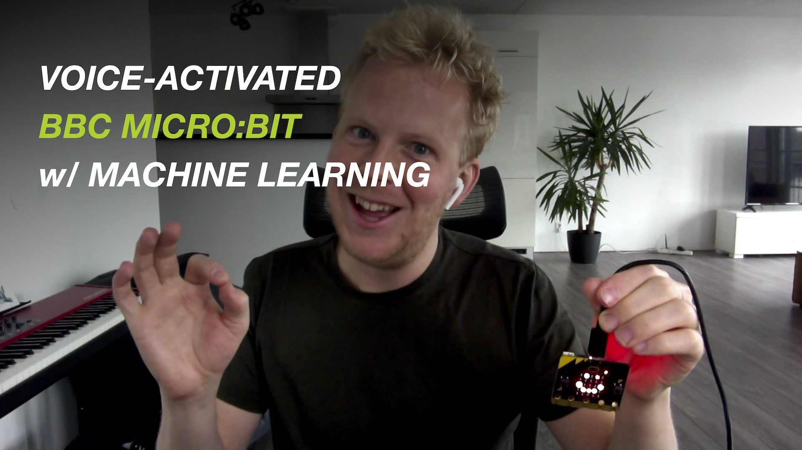

# Voice activated micro:bit

A demo application that makes your micro:bit (2020 model) respond to your voice, built with Edge Impulse. This demo uses Machine Learning to analyze the audio feed coming from the microphone, then showing a smiley on screen when it hears "microbit".

Video tutorial:

[](https://www.youtube.com/watch?v=fNSKWdIxh8o&feature=youtu.be)

## How to build (local)

1. Install [CMake](https://cmake.org), [Python 2.7](https://www.python.org) and the [GNU ARM Embedded Toolchain 9](https://developer.arm.com/tools-and-software/open-source-software/developer-tools/gnu-toolchain/gnu-rm). Make sure `arm-none-eabi-gcc` is in your PATH.

    > **Note:** This project currently does not work with GNU ARM Embedded Toolchain 10 ([bug](https://github.com/lancaster-university/codal-microbit-v2/issues/63))!

1. Clone this repository:

    ```
    $ git clone https://github.com/edgeimpulse/voice-activated-microbit
    ```

1. Build the project:

    ```
    $ python build.py
    ```

1. And flash the binary to your micro:bit, by dragging `MICROBIT.hex` onto the `MICROBIT` disk drive.

## How to build (Docker)

1. Build the container:

    ```
    $ docker build -t microbit_ei_build .
    ```

1. Build the project:

    ```
    $ docker run --rm -v $PWD:/app microbit_ei_build
    ```

1. And flash the binary to your micro:bit, by dragging `MICROBIT.hex` onto the `MICROBIT` disk drive.

## Viewing the Machine Learning model

The ML model that powers this project is available on Edge Impulse: [Micro:bit LIVE 2020](https://studio.edgeimpulse.com/public/13079/latest).

## How to change the keyword

You can build new models using [Edge Impulse](https://docs.edgeimpulse.com/docs).

1. [Sign up for an account](https://studio.edgeimpulse.com) and open your project.
1. Download the [base dataset](https://cdn.edgeimpulse.com/datasets/microbit-keywords-11khz.zip) - this contains both 'noise' and 'unknown' data that you can use.
1. Go to **Data acquisition**, and click the 'Upload' icon.
1. Choose all the WAV items in the dataset and leave all other settings as-is. Click **Upload**.
1. Go to **Devices** and add your mobile phone.
1. Go back to **Data acquisition** and now record your new keyword many times using your phone at frequency 11000Hz.
1. After uploading click the three dots, select *Split sample* and click *Split* to slice your data in 1 second chunks.
1. Follow [these steps](https://docs.edgeimpulse.com/docs/audio-classification#4-design-an-impulse) to train your model.

    > Note: use window length 999 instead of 1000!

Once you've trained a model go to **Deployment**, and select **C++ Library**. Then:

1. Remove `source/edge-impulse-sdk`, `source/model-parameters` and `source/tflite-model`.
1. Drag the content of the ZIP file into the `source` folder.
1. If you've picked a different keyword, change this in [source/MicrophoneInferenceTest.cpp](source/MicrophoneInferenceTest.cpp).

    > Note: the name used for the label of the training-set should correspond exactly to the ```#define INFERENCING_KEYWORD```

1. Rebuild your application.
1. Your micro:bit now responds to your own keyword 🚀.

### Poor performance due to unbalanced dataset?

Is your model not working properly? Then this is probably due to dataset imbalance (a lot more unknown / noise data compared to your keyword) in combination with our moving average code to reduce false positives.

When running in continuous mode we run a moving average over the predictions to prevent false positives. E.g. if we do 3 classifications per second you’ll see your keyword potentially classified three times (once at the start of the audio file, once in the middle, once at the end). However, if your dataset is unbalanced (there’s a lot more noise / unknown than  in your dataset) the ML model typically manages to only find your keyword in the 'center' window, and thus we filter it out as a false positive.

You can fix this by either:

1. Add more data :-)
2. Or, disable moving average by going into ei_run_classifier.h (in the edge-impulse-sdk directory) and removing:

    ```
        for (size_t ix = 0; ix < EI_CLASSIFIER_LABEL_COUNT; ix++) {
            result->classification[ix].value =
                run_moving_average_filter(&classifier_maf[ix], result->classification[ix].value);
        }
    ```

## Use the power of the crowd to collect keywords

Alternatively you can use the power of the crowd to collect your keywords. This is very useful in a STEM or conference setting. For this you'll need an API key, which you'll find under **Dashboard > Keys > Add new API key**.

Then construct the following URL:

```
https://smartphone.edgeimpulse.com/keyword.html?apiKey=ei_XXX&sampleLength=30000&keyword=microbit&frequency=11000
```

Where you replace:

* `ei_XXX` with your API key.
* `30000` with the desired length that people need to record for in milliseconds (here 30000 = 30 seconds).
* `microbit` with the keyword people should say.
* `frequency` the audio frequency. Keep this at 11KHz for the micro:bit v2.

You can share this link f.e. via a QR code (you generate one [here](https://www.the-qrcode-generator.com) to easily include in a presentation).

**NOTE:** People will have access to your full project through this API key. Revoke the API key after your presentation!!
